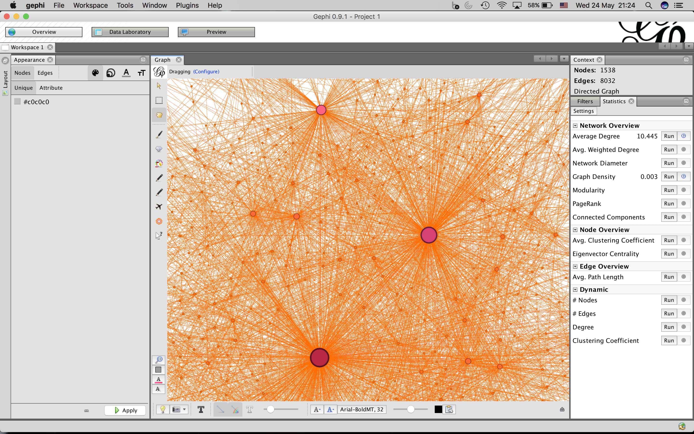
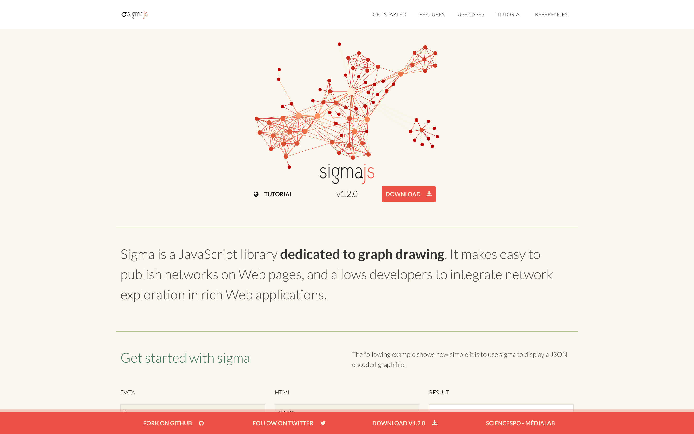
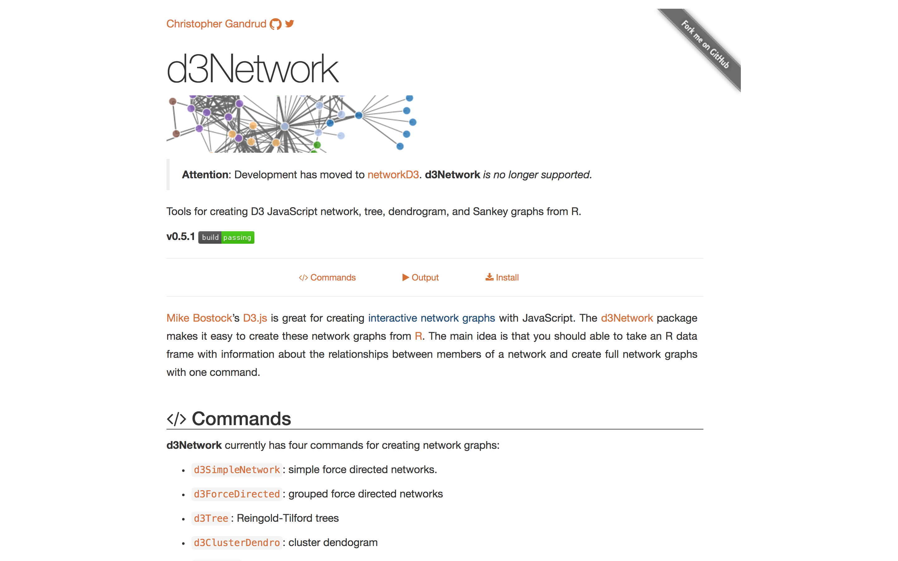
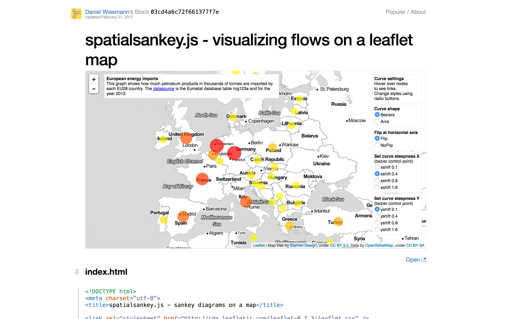
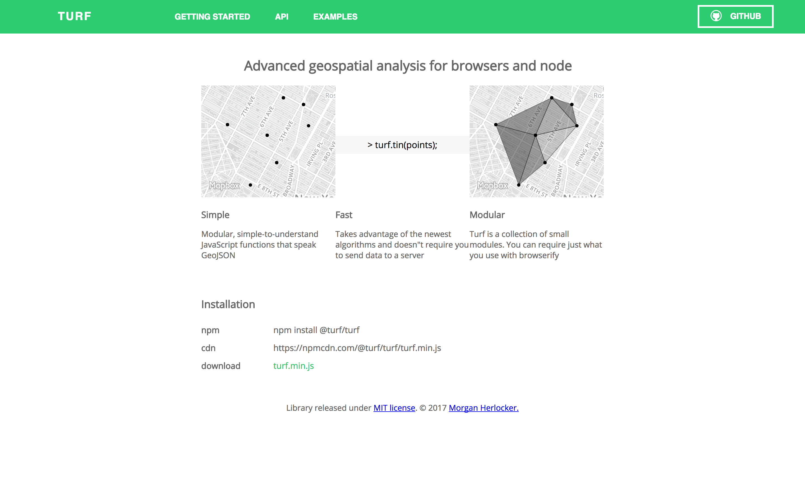

## Network Visualisation

> Chris Cosgrove 25th May 2017
>

##### A network;

*"a group or system of interconnected people of things"*

##### Academic fields

Social Network Analysis;

​	*"**Social network analysis** (SNA) is the process of investigating **social** structures through the use of **networks** and graph theory. It characterizes networked structures in terms of nodes (individual actors, people, or things within the **network**) and the ties, edges, or links (relationships or interactions) that connect them."*

Network Medicine;

​	*"**Network medicine** is the application of network science towards identifying, preventing, and treating diseases. This field focuses on using network topology and network dynamics towards identifying diseases and developing medical drugs"*

Narrative Network Analysis

​	*"A **narrative network** is a system which represents complex event sequences or characters’ interactions as depicted by a narrative text. Network science methodology offers an alternative way of analysing the patterns of relationships, composition and activities of events and actors studied in their own context. Network theory can contribute to the understanding of the structural properties of a text and the data contained in it."*

Link analysis

​	*"**Link analysis** is a subset of network analysis, exploring associations between objects. An example may be examining the addresses of suspects and victims, the telephone numbers they have dialed and financial transactions that they have partaken in during a given timeframe, and the familial relationships between these subjects as a part of police investigation."*

**Network Visualisation Applications**

*Gephi*

**[Gephi](https://gephi.org/)** is an open-source interactive visualization and exploration platform for all kinds of networks and complex systems, dynamic and hierarchical graphs.

Gephi is a tool for people that have to **explore and understand graphs**. Like Photoshop but for graphs, the user interacts with the representation, manipulate the structures, shapes and colors to reveal hidden properties. The goal is to help data analysts to make hypothesis, intuitively discover patterns, isolate structure singularities or faults during data sourcing. It is a complementary tool to traditional statistics, as visual thinking with interactive interfaces is now recognized to facilitate reasoning.

*Sigma.js*

[Sigma.js](http://sigmajs.org/) is a JavaScript library **dedicated to graph drawing**. It makes easy to publish networks on Web pages, and allows developers to integrate network exploration in rich Web applications.

*d3Network*

[d3Network](http://christophergandrud.github.io/d3Network/) (or *[networkD3](http://christophergandrud.github.io/networkD3/)*) is a series of tools developed by **Christopher Gandrud** to make interactive network graphs using D3.js. Graphical solutions include force-directed networks, Sankey diagrams, Radial Networks and Dendro Networks.

*spatialsankey.js*

[spatialsankey.js](http://bl.ocks.org/yellowcap/03cd4a6c72f661377f7e) is javascript program for visualising flows between georeferenced targets and sources on a leaflet map. 

*turf.js*

[turf](http://turfjs.org/) is a powerful collection of geospatial analysis tools that that operate on GeoJSON tools either in the browser or in [node](https://nodejs.org/en/) on the terminal. It can be intergrated into mapbox and leaflet. See [here](http://hatschit.alkaid.uberspace.de/IDW_TURF_Choropletes/Potsdam_example.html) for an example of turf IDW in action.

 